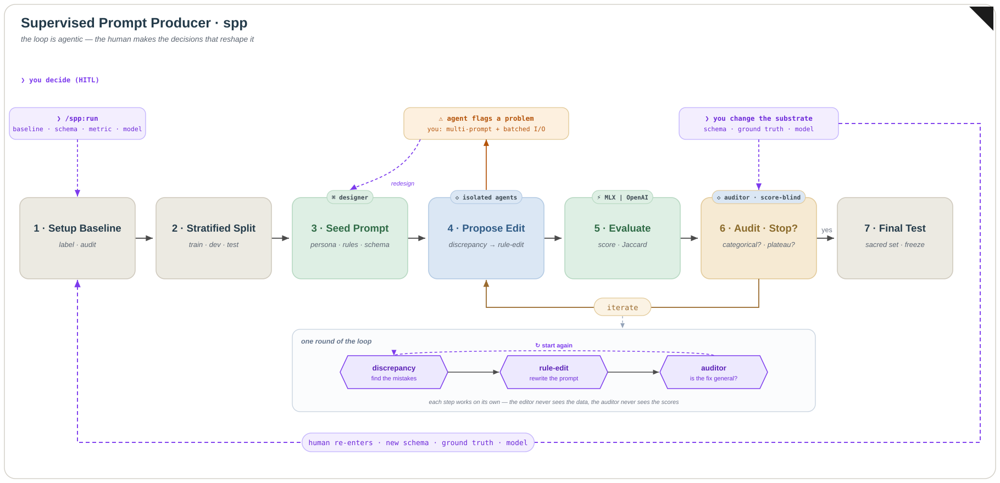

# spp — Supervised Prompt Producer

[](LICENSE)
[](https://github.com/JayLBean/supervised-prompt-producer/releases)
[](https://jaylbean.github.io/spp-site/installation.html)
[](https://jaylbean.github.io/spp-site/)
[](https://jaylbean.github.io/spp-benchmark/)

A Claude Code plugin for **disciplined, human-in-the-loop supervised prompt
learning**: it turns a labeled baseline into a production-grade prompt you can
defend in code review with evidence, not vibes.

Full documentation — methodology, installation, and usage — is at the
**[spp docs site](https://jaylbean.github.io/spp-site/)**.

`spp` handles **classification** (binary, multi-class, fixed-schema),
**multi-field and hierarchical structured output**, **structured extraction**
(variable-cardinality, span-grounded), and **prompt decomposition** (a managed
linear pipeline) — anything with a labeled ground truth and a mechanical metric.
It is deliberately *not* a generation, RAG, agentic, or prompt-search tool (see
[`DESIGN.md`](DESIGN.md) §7.1.3). For what shipped, see
[`CHANGELOG.md`](CHANGELOG.md); for the roadmap and scope, [`DESIGN.md`](DESIGN.md) §7.1.

---

## Why

Prompt engineering by feel produces prompts that *look* good and fail in
production — tuned against whatever rows the author remembered, shipping with
failures clustered where no one looked. Automated optimizers (DSPy, APE) go the
other way: they trust a metric and search, which works only if the metric is
honest — and a metric computed against one model on one labeled set rewards
learning the dataset's quirks and the model's style, both of which look like
generalization until you swap a model or a data slice.

`spp` targets the two failure modes those approaches miss:

- **Baseline overfitting** — the prompt fits your specific labels, not the class
  definition. Scores high on what you tuned against, collapses on
  similar-but-unseen data. A deal-breaker. `spp` defends against it.
- **Model overfitting** — the prompt fits one model's instruction-following
  style. Fine *if you know it* and ship accordingly; dangerous if it ships
  unmarked. `spp` documents and surfaces it.

### The example that motivates both

The methodology comes from a hair-loss-discourse classifier that produced a
Qwen-locked prompt at `test F1 = 0.941`. Run cross-family, it split:

| Model | F1 |
|---|---|
| Qwen3-14B (optimized target) | 0.941 |
| GPT-4o full | ≈ 0.91 |
| GPT-4o-mini | ≈ 0.76 |

The failures were not random — they clustered, and were length-correlated rather
than purely capability-related: the prompt encoded a Qwen-specific length
tolerance the GPT family did not share. That is model overfitting, caught and
documented rather than shipped unmarked. Baseline overfitting is what a
less-disciplined run on the same labels would have produced — caught here by the
stratified split and the auditor.

---

## How it works

```
Phase 1   Label baseline + adversarial label review
Phase 1.5 Stratified split (train / dev / sacred test)
Phase 2   Optimization loop:
            propose edit from discrepancy analysis
            → AUDITOR: categorical or row-specific?
            → run on dev → overfitting guard
            → stop when dev plateaus or regresses
Phase 3   Final test on the sacred set, exactly once
            → REPORT.md + frozen prompt + documented limitations
```

Two properties are non-negotiable and are what separate `spp` from an automated
optimizer:

- **Per-stage information isolation.** Each cognitive stage of an iteration runs
  in an isolated sub-agent with an explicit input allow-list: a **discrepancy**
  stage that reads disagreed rows and abstracts them into clusters by ID; a
  **rule-edit** stage that proposes the next prompt without ever seeing row
  content; an **auditor** that reviews the edits but never sees the new scores.
  State flows through files, not a shared context. The auditor's one question —
  is each edit **categorical** (a class of rows with an articulable property) or
  **row-specific** (a patch for one weird row)? — keeps the loop from fitting
  rows it never saw.
- **The sacred test set.** Read exactly once, at finalization. The loop sees
  train + dev only.

The pipeline is agentic, but the decisions that reshape it are human — the
kickoff that configures the run, a mid-loop redesign when an agent flags a
structural problem, and any change to the schema, ground truth, or model.



The four phases map to `skills/run/phases/spp-{init,baseline,loop,finalize}.md`;
the loop's internals are in [`spp-loop.md`](skills/run/phases/spp-loop.md) §4.

### Automated vs. human

| Automated | You stay in the loop |
|---|---|
| Stratified split generation | Metric design |
| Running iterations against dev | Baseline labeling judgment |
| Discrepancy analysis | Decision criteria for ambiguous rows |
| Categorical-vs-row-specific auditing | Model selection |
| `REPORT.md` generation | Whether an edit is generalized or reverted |
| Sacred-test-set protection | Production ship / no-ship |

---

## When to use it

A good fit when most of these hold (match ~three of five and it's worth trying):

- The prompt runs **frequently in production** (rule of thumb: ≥1000 runs), so
  the fixed methodology cost amortizes.
- It's a **classification or extraction task with labeled ground truth** —
  including multi-field, hierarchical, span-grounded, or a decomposed pipeline.
- **Model lock-in is known or acceptable.** `spp` optimizes one model at a time;
  run it per target model and compare downstream.
- You will **label baseline rows carefully** (typically 50–100), with the
  `baseline-quality` adversarial review. Bring your own labels if you have them.
- Your **data may be multilingual** — tag rows with a BCP-47 `language` column
  (or let `preprocess` detect it) for language-stratified splits and per-language
  metrics.

**Don't use it for** one-shot or chat prompts, generation / RAG / agentic / tool-use
tasks, tasks without trustworthy labels, or prompt-injection defense — these need
different validation primitives and are deliberate non-goals
([`DESIGN.md`](DESIGN.md) §7.1.3).

---

## Installation

`spp` ships as a Claude Code plugin. From inside Claude Code:

```
/plugin marketplace add JayLBean/supervised-prompt-producer
/plugin install spp@supervised-prompt-producer
```

For local development against an unreleased version:

```sh
git clone https://github.com/JayLBean/supervised-prompt-producer.git
cd supervised-prompt-producer
claude --plugin-dir ./
```

## Quickstart

From a project with a labeled baseline, describe your task to Claude Code or
invoke `/spp:run <task-name>` — the **only** command you type. You invoke it
**once**; the skill's router then walks the four phases and the six human gates
(**G1–G6**). The phases below (Init, Baseline, Loop, Finalize) are internal
steps the router runs, not commands you call directly.

1. **Init** — the designer agent consults you, surfaces the metric and
   class definitions, and writes `plan.md`. Approve at **G1**.
2. **Baseline** — label rows (or review labels you have) with
   `baseline-quality`, then generate the stratified split. Approve at **G2/G3**.
3. **Loop** — iterations run against dev with the auditor active. Approve
   the dry-run at **G4**; the loop stops on plateau, the overfitting guard, or
   you.
4. **Finalize** — the frozen prompt runs against the sacred set once and
   `REPORT.md` is generated. Decide ship / no-ship at **G6**.

A worked end-to-end example is in
[`examples/hair-loss-relevance/`](examples/hair-loss-relevance/); the full set
(multi-field, nested-schema, extraction, feature-group split, decomposition
pipeline) is indexed in [`examples/`](examples/).

---

## Compared to alternatives

- **vs. DSPy / GEPA / APE.** Those fuse edit proposal and metric-driven
  selection. `spp` keeps them separate so the auditor reviews edits *before* any
  selection signal — the part automated optimizers don't have. Complementary at
  the boundary: `spp`'s baseline, split, metric, and audited prompt are a clean
  starting point for one.
- **vs. manual prompt engineering.** Adds a labeled baseline, a sacred test set,
  audited edits, and versioned, reproducible artifacts. Evidence, not vibes.
- **vs. no methodology.** The overhead is labeling + gate discipline; it
  amortizes fast for prompts running ≥1000 times, and isn't worth it for one-shots.

### Benchmark — spp vs EvoPrompt vs DSPy

A three-way comparison on three public classification tasks (AG News, SST-5, TREC),
all on the **same task model** (`gpt-5-nano`), the **same seed prompt**, and the
**same sacred test set**. Accuracy is on the held-out test; cost is gpt-5-nano spend
(list price $0.05/1M input, $0.40/1M output, dashboard-verified). EvoPrompt and `spp`
ran 0-shot; DSPy (MIPROv2) ran few-shot — its design strength, included honestly.

| Task | Seed | EvoPrompt | DSPy (few-shot) | **spp** |
|---|---:|---:|---:|---:|
| AG News | 0.870 | 0.869 / $0.18 | **0.881** / $0.15 | 0.876 / **$0.04** |
| SST-5 | 0.557 | 0.561 / $0.21 | **0.580** / $0.19 | 0.579 / **$0.10** |
| TREC | 0.828 | 0.804 / $0.24 | 0.874 / $0.18 | **0.924** / **$0.11** |
| Mean acc | 0.752 | 0.745 | 0.778 | **0.793** |

`spp` posts the highest mean accuracy and the lowest task-model cost on every task,
wins TREC outright (+5 over the nearest arm), and matches DSPy's *few-shot* accuracy
with *zero* demonstrations on AG News and SST-5. The honest caveat: this cost counts
**task-model spend only** — `spp` shifts its optimizer cost onto Claude subagents and
a human, which is not billed here.

The full benchmark is published as a live site:
**<https://jaylbean.github.io/spp-benchmark/>**
([source](https://github.com/JayLBean/spp-benchmark)). It carries the complete numbers,
token breakdowns, and fairness ledger, plus per-task **loop logs** — every iteration and
the human-in-the-loop gate exchange that produced each prompt. The same TREC arm also
ships in-repo as a complete, real artifact set in the
[`public-benchmark` example](examples/public-benchmark/RESULTS.md).

---

## Contributing & license

MIT-licensed ([`LICENSE`](LICENSE)). Contributions welcome — read
[`CONTRIBUTING.md`](CONTRIBUTING.md) first for commit format, PR scope, and which
changes need design discussion. Community guidelines:
[`CODE_OF_CONDUCT.md`](CODE_OF_CONDUCT.md).

`spp` is indebted to **DSPy** (reproducible prompt optimization, a different
posture), the **`prompt-architect`** six-section XML template it builds on, and
the source hair-loss-discourse project that produced the canonical
Phase 1 → 1.5 → 2 → 3 workflow and its failure-cluster taxonomy.
