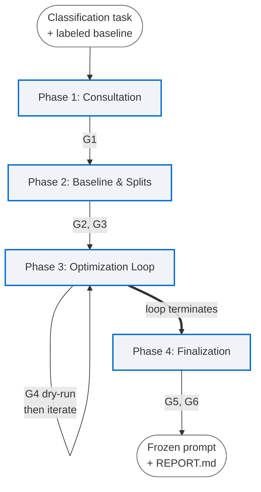

# spp — Supervised Prompt Producing

A Claude Code plugin for **disciplined, human-in-the-loop supervised
prompt learning**. The methodology — per-stage information isolation,
auditor judgment, sacred test set, six-section prompt structure — is
output-shape-agnostic and applies to any supervised prompt-engineering
task with a labeled baseline. **v0.1.0 instantiates the methodology for
single-output classification** (binary, multi-class, fixed-schema
labeling). v0.2 generalizes the bookkeeping to broader output shapes —
multi-field structured output, hierarchical labels, freeform extraction
with structured ground truth. See [`DESIGN.md`](DESIGN.md) §7.1 for the
full roadmap and the deliberate non-goals.

> **Status:** v0.1.0 release prep. The methodology and the v0.1.0
> bookkeeping are settled. See [`CHANGELOG.md`](CHANGELOG.md) for what
> ships when, and [`DESIGN.md`](DESIGN.md) §7.1 for what comes next.

---

## The problem

Prompt engineering by feel produces prompts that *look* good and fail in
production. A prompt is judged by whatever ad-hoc examples its author
remembers; failures cluster in places no one thought to test; the prompt
ships, scores well on the rows it was tuned against, and silently
under-performs on the rest.

Existing automation goes the other way. Frameworks like DSPy and APE
trust a metric and let an optimizer search prompt variants until the
metric goes up. That works *if* the metric is honest. But the metric is
usually computed against one model on one labeled set, and a clever
optimizer will happily learn the dataset's quirks and the model's
instruction-following style — both of which look like generalization
right until you swap a model or a data slice.

Both approaches miss two distinct failure modes that need to be treated
differently:

- **Baseline overfitting** — the prompt fits the specific labels in your
  baseline rather than the underlying class definition. It scores high on
  what you tuned against and collapses on similar-but-unseen data. This is
  a deal-breaker.
- **Model overfitting** — the prompt fits one model's instruction-following
  style. It can be production-grade for that model and fragile across
  others. This is contextually fine *if you know it* and ship accordingly;
  it is dangerous if it ships unmarked.

`spp` is a methodology, packaged as a Claude Code skill, that produces
prompts which survive contact with real labeled data. It enforces
discipline; it does not replace human judgment.

---

## The two failure modes (with a real example)

The methodology comes from a hair-loss-discourse classification project
that produced a Qwen-locked prompt with `test F1 = 0.941`, `recall = 1.0`.
That prompt was excellent — *for that model*. When the same prompt was
run cross-family on the GPT line, results split:

| Model | F1 |
|---|---|
| Qwen3-14B (optimized target) | 0.941 |
| GPT-4o full | ≈ 0.91 |
| GPT-4o-mini | ≈ 0.76 |

The cross-model failures were not random. They clustered. On the three
rows in failure cluster 4.4 ("cross-family register-vs-addressee
weighting"), GPT-4o full **resolved the shortest of the three and failed
on the two longest**. GPT-4o-mini failed on all three. The failure was
**length-correlated, not purely capability-related** — additional model
capability resolved the short case but the longer rows remained failure
modes for both GPT models. The prompt encoded a Qwen-specific length
tolerance that the GPT family did not share.

This is the load-bearing example for both failure modes:

- **Baseline overfitting** is what a less-disciplined methodology would
  have produced on the same labels: a prompt with high training-set
  agreement that fails on similar Reddit comments the loop never saw.
  Caught here by the stratified train/dev/test split and the auditor
  sub-agent (see below).
- **Model overfitting** is what *did* happen, by design. The Qwen prompt
  was optimized against Qwen, scored honestly, shipped against Qwen, and
  documented as model-locked. It is acceptable for production with model
  lock-in. It is not acceptable as an unmarked default.

`spp` defends against the first. It documents and surfaces the second.

---

## The methodology

```
Phase 1   Label baseline + adversarial label review
            |
Phase 1.5  Stratified split (train / dev / sacred test)
            |
Phase 2   Optimization loop
            ├─ propose prompt edit from discrepancy analysis
            ├─ AUDITOR review:  categorical or row-specific?
            ├─ run on dev set
            ├─ check overfitting guard (train vs dev divergence)
            └─ stop when dev plateaus or regresses
            |
Phase 3   Final test on sacred held-out set
            |
            └─ REPORT.md + frozen prompt + documented limitations
```

**Phase 1.** Label 50–100 representative rows. The `baseline-quality`
sub-skill adversarially reviews the labels themselves: borderline cases,
inter-rater spot-checks, calibration questions. Bad baselines produce
polished noise that no later phase can recover from, so this phase gets
its own discipline.

**Phase 1.5.** Stratified train/dev/test split with class balance
preserved. The test set is *sacred* — it is not touched until Phase 3.
The optimization loop sees train + dev only.

**Phase 2.** Iterate. Each iteration runs the current prompt on dev,
analyzes discrepancies, proposes rule edits, and runs the next iteration.
Two things are non-negotiable:

- **Dev-driven stop.** The loop terminates when dev F1 plateaus or
  regresses. Train-vs-dev divergence is itself a stop signal (the
  overfitting early-stop guard).
- **Per-stage information isolation.** Every cognitive stage of the
  iteration runs in an isolated sub-agent with an explicit allow-list
  of inputs: a **discrepancy** sub-agent that reads the disagreed
  rows and abstracts them into clusters by ID; a **rule-edit**
  sub-agent that proposes the next prompt without ever seeing row
  content; an **auditor** sub-agent that reviews the proposed edits
  but never sees the new scores. Each sub-agent's context terminates
  when it returns; state flows through files, not through a shared
  context. The auditor's single question is whether each edit is
  **categorical** ("addresses a class of rows defined by an
  articulable property") or **row-specific** ("patches one weird
  row"). Categorical edits are kept; row-specific ones are flagged
  for revert or generalization. This per-stage information isolation
  is the design lock that distinguishes `spp` from automated
  optimizers — the auditor cannot be swayed by improvement size,
  the rule-edit sub-agent cannot fit specific rows it never saw,
  and the discrepancy sub-agent cannot echo prior iterations'
  proposals it does not have access to.

**Phase 3.** Run the frozen prompt on the sacred test set, exactly once.
Generate `REPORT.md` with metrics, confusion matrix, failure cluster
taxonomy, and a Limitations section that names the model the prompt was
optimized against and any cross-model fragility observed.

### The pipeline at a glance

The four phases and the six HITL gates that interleave between them.
Phase 3's optimization loop iterates internally (dry-run at G4, then
discrepancy → propose edits → auditor verdict → continue or stop) — that
detail belongs in the phase doc rather than this top-level diagram.
What this diagram shows is the methodology's shape: four phases, six
gates, one loop.



Phase mapping: Phase 1 reads `skills/run/phases/spp-init.md` (the
designer agent consults the user and writes `plan.md`); Phase 2 reads
`skills/run/phases/spp-baseline.md` (the `baseline-quality` sub-skill
audits labels, then a stratified split is generated); Phase 3 reads
`skills/run/phases/spp-loop.md` (the optimization loop with the
auditor active per iteration); Phase 4 reads
`skills/run/phases/spp-finalize.md` (the sacred test set runs exactly
once, then the REPORT and frozen prompt are generated). The auditor's
categorical-vs-row-specific judgment inside Phase 3 is the design lock
that distinguishes `spp` from automated optimizers; for the loop's
internal mechanics see [`skills/run/phases/spp-loop.md`](skills/run/phases/spp-loop.md)
§4.

---

## What `spp` does and doesn't automate

| Automated | Not automated (you stay in the loop) |
|---|---|
| Stratified split generation | Metric design |
| Running prompt iterations against the dev set | Baseline labeling judgment |
| Discrepancy analysis between predictions and labels | Decision criteria for ambiguous rows |
| Categorical-vs-row-specific auditing of edits | Model selection |
| `REPORT.md` generation | Whether a row-specific edit *should* be generalized or reverted |
| Sacred-test-set protection | Production ship/no-ship decision |

`spp` enforces discipline. It does not pretend to replace the human
judgments that the discipline is built around.

---

## When to use this

`spp` is typically a good fit when most of the following hold. None of
them are hard gates on their own — they describe the kinds of projects
where the methodology's overhead is repaid quickly. If you match three
of five, it's likely worth trying.

- The prompt will run **frequently in production** (rule of thumb: ≥1000
  runs). The methodology cost is a fixed overhead; the per-run benefit
  compounds.
- The task is a **single-output classification task** — binary,
  multi-class, or fixed-schema labeling where each row resolves to one
  categorical label. v0.1.0's bookkeeping (`plan.md` schema,
  `metric-design`'s metric list, `/spp-loop`'s scoring step,
  `REPORT.md`'s shape) is hardcoded for this output shape; this
  bullet *is* a hard gate for v0.1.0.
- **Model lock-in is known or acceptable.** v0.1.0 optimizes for one
  production model at a time. Multi-model dev loops are roadmap.
- You are **willing to label baseline rows** carefully, with the
  `baseline-quality` adversarial review. Baseline size is your call —
  typically 50–100 rows works well, but the methodology adapts to
  whatever you can support. Smaller baselines limit statistical
  confidence; larger baselines increase Phase 1 cost. Bring your own
  labels if you have them.
- Your **data is in English**. v0.1.0 explicitly assumes English text;
  multilingual classification is a separate design pass.

If your task is multi-field structured output, hierarchical labels, or
extraction with structured ground truth, the methodology applies but
v0.1.0's bookkeeping does not yet cover the output shape. v0.2's
canonical scope is exactly that generalization; until it ships, you
can either wait or walk the methodology informally (treating the
output schema as the user's responsibility rather than the skill's).
See [`DESIGN.md`](DESIGN.md) §7.1.1 for the v0.2 scope details.

**Feature-group prompt splitting.** For tasks whose output spans
multiple feature groups — subsets of fields sharing a reasoning
pattern, input dependency, or metric profile — `spp` recommends
decomposing into separate task directories, one per group, and
composing the resulting prompts in your production pipeline. See
[`DESIGN.md`](DESIGN.md) §10 glossary entry "Feature-group prompt
splitting" for the principle; the designer agent surfaces the
decision during `/spp-init` consultation. The exception is K=1 or
schemas where field interdependencies are dense enough that
splitting introduces more coordination overhead than it saves —
e.g., the canonical bucket-7 example
[`examples/nested-schema/`](examples/nested-schema/) exemplifies the
hierarchical-conditional-reasoning case that stays unified.

## When NOT to use this

- One-shot or chat prompts where reproducibility is not a concern.
- Generation tasks (summarization, rewriting, instruction tuning).
  These are deliberate non-goals — different validation primitives,
  not roadmap items. See [`DESIGN.md`](DESIGN.md) §7.1.3.
- Tool-using or agentic prompts. Also a deliberate non-goal —
  orchestration problem, not a prompt-quality problem.
- Tasks without ground truth. `spp` requires labels you trust.
- Adversarial-robustness or prompt-injection-defense tasks. Different
  problem with different evaluation primitives.
- Quick exploratory work where the discipline overhead exceeds the
  value.

---

## Installation

`spp` ships as a Claude Code plugin. From inside Claude Code:

```
/plugin marketplace add JayLBean/supervised-prompt-producer
/plugin install spp@supervised-prompt-producer
```

The first command registers this repository as a Claude Code marketplace
(it carries a single plugin); the second installs the `spp` plugin from
that marketplace. Plugin and marketplace docs:
[code.claude.com/docs/en/plugins](https://code.claude.com/docs/en/plugins),
[code.claude.com/docs/en/plugin-marketplaces](https://code.claude.com/docs/en/plugin-marketplaces).

For local development against an unreleased version, clone the repo and
load the plugin directly:

```sh
git clone https://github.com/JayLBean/supervised-prompt-producer.git
cd supervised-prompt-producer
claude --plugin-dir ./
```

## Quickstart

> The skill itself is in development. Once shipped (v0.1.0), the flow is:

1. Install via the plugin marketplace as above (or load locally with
   `claude --plugin-dir ./`).
2. From a project where you have a labeled baseline, either describe
   your classification task to Claude Code or invoke `/spp:run
   <task-name>`. The skill's router then walks the four phases below
   as the designer agent guides you through the human-in-the-loop gates
   **G1–G6**. The four `/spp-*` names below are the skill's internal
   phase commands — documentation for what the skill does at each step,
   **not slash commands you type separately**. You invoke `/spp:run`
   once; the router routes.
3. **Phase 1 — `/spp-init`.** The designer agent consults with you about
   the task, surfaces the metric and class definitions, and produces
   `plan.md`. Approve at **G1**.
4. **Phase 2 — `/spp-baseline`.** The skill walks you through labeling
   rows you provide (or reviews labels you already have, with
   `baseline-quality` adversarial review), then generates the stratified
   train/dev/test split. Approve the labels at **G2** and the split at
   **G3**.
5. **Phase 3 — `/spp-loop`.** Iterations run against your dev set with
   the auditor active. Approve the dry-run at **G4**; the loop stops on
   dev plateau, the overfitting guard, or your manual termination.
6. **Phase 4 — `/spp-finalize`.** The frozen prompt runs against the
   sacred test set exactly once and the skill generates `REPORT.md`.
   Decide ship / no-ship at **G6**.

For a worked end-to-end walkthrough see
[`examples/hair-loss-relevance/`](examples/hair-loss-relevance/).

---

## Comparison to alternatives

**vs. DSPy, GEPA, APE, and other automated prompt optimizers.** These
frameworks automate prompt search using a metric-driven optimizer:
generate candidate edits, evaluate against a metric, select the best,
iterate. `spp` deliberately rejects this approach for v1 because the
auditor information-isolation property — which catches row-specific
edits before they compound across iterations — depends on the auditor
reviewing edits *before* any selection signal is applied. Frameworks
that fuse proposal and selection cannot accommodate that separation
without giving up their core value proposition. The two are not mutually
exclusive at the methodology boundary: `spp` produces a labeled
baseline, a stratified split, a defensible metric, and an audited
prompt that downstream optimizers can use as a starting point. The
auditor sub-agent in `spp` is precisely the part that automated
optimizers don't have, and is why `spp` does not claim to be one.

**vs. manual prompt engineering.** Manual prompt engineering produces
prompts that look good. `spp` adds discipline (labeled baseline, sacred
test set, auditor review of edits) and reproducibility (versioned
prompts, hashed iterations, REPORT.md per model). The result is a prompt
you can defend in code review with evidence, not vibes.

**vs. no methodology.** `spp`'s overhead is the labeling and the gate
discipline. For prompts running ≥1000 times in production, that overhead
is amortized fast. For one-shot prompts, don't bother.

---

## Roadmap

`spp` v0.1.0 supports binary and multi-class classification with
fixed-schema labels, in English, against a single model at a time.

Future work (separate design passes per item):

- **v0.2** — Extraction tasks (named entity, span extraction). Loop
  resumption mid-iteration. Possibly extracting `prompt-architect` and
  `metric-design` as peer skills if usage signal supports it.
- **v0.3** — Multi-judge subjective metrics for tasks where ground truth
  itself requires LLM judgment.
- **v0.4** — Multi-model dev loops with cross-model summary documents.
  This is the v2 methodology hinted at by the source project's GPT-4o /
  Qwen comparison.
- **Separate design pass** — Multilingual data. Generation tasks. RAG
  prompts. Agentic prompts.

Roadmap items will not be quietly bolted onto v0.1.x. See
[`DESIGN.md`](DESIGN.md) §7.1 for the canonical list of v1 non-goals.

---

## Citations and acknowledgements

`spp` builds on prior work in disciplined prompt engineering and is
indebted to:

- **DSPy** — for proving that prompt optimization can be made
  reproducible, even though `spp` takes a different (human-in-the-loop)
  posture.
- **`prompt-architect`** — the six-section XML prompt template
  (Persona, Task, Rules, Output Format, Example Input, Example Output)
  that `spp` invokes for prompt construction.
- The source hair-loss-discourse classification project, which produced
  the canonical workflow (Phase 1 → 1.5 → 2 → 3) that became `spp` and
  the failure-cluster taxonomy (4.1 aggregator quoted-speech, 4.2
  ambiguous short self-disclosure, 4.3 sponsored↔monetized boundary, 4.4
  cross-family register-vs-addressee weighting) that informs the
  methodology's failure-mode framing.

---

## License and contributing

`spp` is MIT-licensed. See [`LICENSE`](LICENSE).

Contributions are welcome. Read [`CONTRIBUTING.md`](CONTRIBUTING.md)
before opening a PR — the project has explicit conventions on commit
format, PR scope, and what kinds of changes need design discussion
first. The community guidelines are in [`CODE_OF_CONDUCT.md`](CODE_OF_CONDUCT.md).
